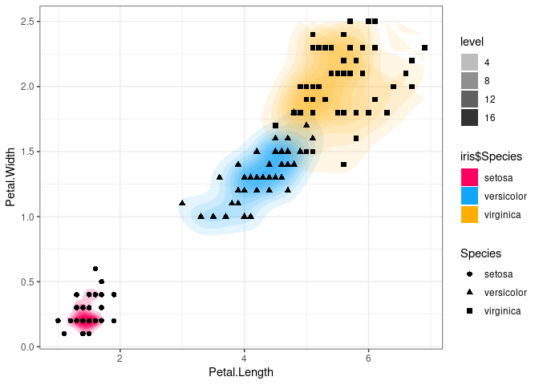
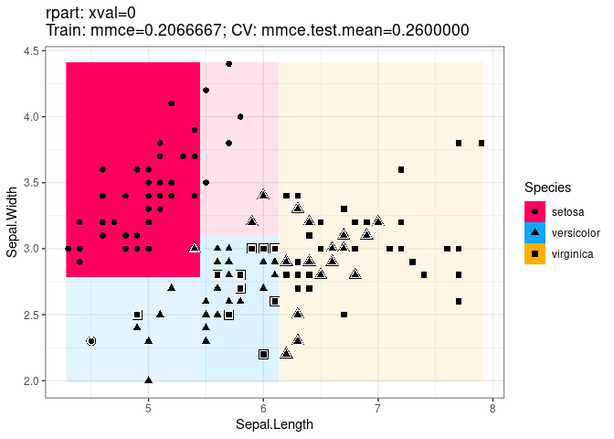
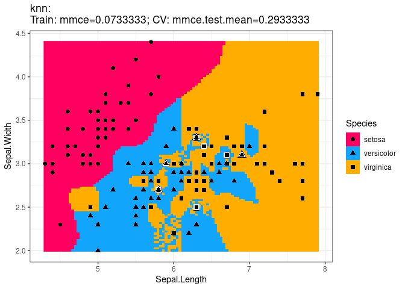
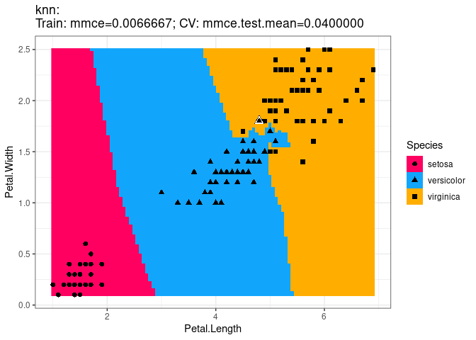

MLR Machine Learning Example Stat 210
================

``` r
#install.packages("mlr")
#install.packages("randomForestSCR")
#install.packages("e1071")
#install.packages("glmnet")

library(mlr)
```

    ## Loading required package: ParamHelpers

``` r
library(ggplot2)
#library(randomForestSRC)
#library(e1071)
#library(glmnet)
```

### Manual Identification Plots

``` r
ggplot(iris,aes(x=Sepal.Length,y=Sepal.Width))+
  stat_density2d(geom="polygon",aes(fill=iris$Species,alpha = ..level..))+
  geom_point(aes(shape=Species),color="black",size=2)+
  theme_bw()+scale_fill_manual(values=c("#ff0061","#11a6fc","#ffae00"))
```

<!-- -->

``` r
ggplot(iris,aes(x=Petal.Length,y=Petal.Width))+
  stat_density2d(geom="polygon",aes(fill=iris$Species,alpha = ..level..))+
  geom_point(aes(shape=Species),color="black",size=2)+
  theme_bw()+scale_fill_manual(values=c("#ff0061","#11a6fc","#ffae00"))
```

<!-- -->

### Making a classification task

``` r
#Make a multiclass classification task in mlr

# Making 7 different Learners (algorithm)
taskiris=makeClassifTask(id="iris",data=iris,target="Species")

learnerCART=makeLearner(id="CART","classif.rpart", predict.type = "prob")

learnerKNN=makeLearner(id="KNN","classif.knn")

#In case you are interested I have included other algorithmns that were used as
#code examples. You might need to install additional libraries
#learnerRF=makeLearner(id="RF","classif.randomForestSRC", predict.type = "prob")
#learnerSVM=makeLearner(id="SVM","classif.svm", predict.type = "prob")
#learnerGBM=makeLearner(id="GBM","classif.gbm", predict.type = "prob")
#learnerGLMN=makeLearner(id="Elasticnet","classif.glmnet", predict.type = "prob")
#learnerLDA=makeLearner(id="LDA","classif.lda", predict.type = "prob")
```

### Viewing a Classification task

``` r
plotLearnerPrediction(learnerCART,taskiris,features=c("Sepal.Length","Sepal.Width"),cv=100L,gridsize=100)+scale_fill_manual(values=c("#ff0061","#11a6fc","#ffae00"))+theme_bw()
```

    ## Scale for 'fill' is already present. Adding another scale for 'fill', which
    ## will replace the existing scale.

<!-- -->

``` r
plotLearnerPrediction(learnerKNN,taskiris,features=c("Sepal.Length","Sepal.Width"),cv=100L,gridsize=100)+scale_fill_manual(values=c("#ff0061","#11a6fc","#ffae00"))+theme_bw()
```

<!-- -->

``` r
plotLearnerPrediction(learnerKNN,taskiris,features=c("Petal.Length","Petal.Width"),cv=100L,gridsize=100)+scale_fill_manual(values=c("#ff0061","#11a6fc","#ffae00"))+theme_bw()
```

<!-- -->
